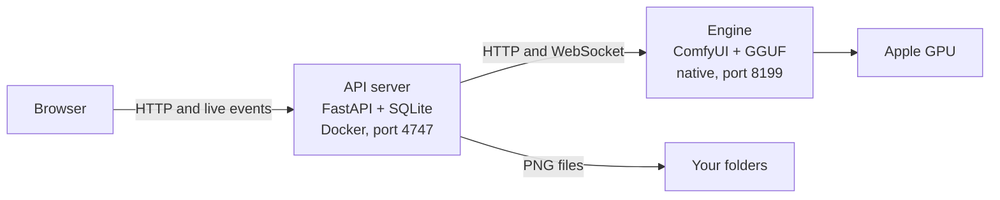

<p align="center">
  
</p>

<h1 align="center">Image Studio</h1>

<p align="center">
  A local image studio for <b>Qwen-Image 2.1</b> on an Apple silicon Mac.<br>
  Type a prompt, edit and combine your own images, and chain generations on a canvas.<br>
  Everything runs on your Mac. No account, no cloud, no upload.
</p>

<p align="center">
  <a href="LICENSE"></a>
  
  
  <a href="https://github.com/tamimKTH/image-studio/releases/latest"></a>
</p>

<p align="center">
  Needs an Apple silicon Mac with <b>64 GB of memory</b> and about 95 GB of free disk. A 1K image took 85 to 100 seconds on an M5 Max.<br>
  <a href="#install-with-an-ai-coding-agent"><b>Install with one prompt</b></a> in Claude Code, Codex, Gemini CLI or Cursor, or <a href="#install-by-hand">install by hand</a>.
</p>

<picture>
  <source media="(prefers-color-scheme: dark)" srcset="docs/images/hero-dark.webp">
  
</picture>

## What it does


- **Create from a prompt.** Pick an aspect ratio and 1K or 2K, press ⌘↵, and watch the image form with a live step counter.
- **Edit and combine your images.** Drop in up to 10 images and refer to them by number: "hang image 2 on the wall in image 1".
- **Transparent PNGs and cutouts.** Ask for a transparent background, or remove the background from any image.
- **Mark an area.** Circle or paint the part of an image to change.
- **Improve your prompt.** Qwen's own prompt enhancers rewrite a short idea into a detailed prompt.
- **Chain steps on a canvas.** Connect Image, Generate and Remove background nodes, then run the whole chain.
- **Run in the background.** Queue as many runs as you like, close the tab, and follow them in Activity.
- **Keep your files yours.** Images are saved as normal PNG files in the folders you choose, with the prompt and settings stored inside each file.

<br clear="right">

<table>
  <tr>
    <td width="33%"></td>
    <td width="33%"></td>
    <td width="33%"></td>
  </tr>
  <tr>
    <td align="center"><b>Activity</b><br>Every run, live</td>
    <td align="center"><b>Run view</b><br>Each step's state and results</td>
    <td align="center"><b>Library</b><br>Your folders and images</td>
  </tr>
</table>

## Quick start

You need an Apple silicon Mac with 64 GB of memory or more, about 95 GB of free disk space, [Docker Desktop](https://www.docker.com/products/docker-desktop/) and [uv](https://docs.astral.sh/uv/).

### Install with an AI coding agent

Paste this prompt into Claude Code, Codex, Gemini CLI or the Cursor agent:

```text
Install Image Studio on this Mac from https://github.com/tamimKTH/image-studio.
Clone it to ~/image-studio, then read .agents/skills/image-studio/SKILL.md
in the clone and follow its Install section.
```

The agent clones the repository, checks your Mac, and asks you one question before it downloads or installs anything. The question lists what it will download and install, the disk space that takes, and the model license. After you say yes, the agent downloads the models, installs the engine and the app, makes a test image, and opens the app.

What you do:

- **Approve the agent's commands.** The install downloads about 37 GB and writes outside the agent's project folder, to `~/image-studio`, `~/ComfyUI-Shared/models`, `~/Library/Application Support/ImageStudio`, `~/Library/LaunchAgents` and `~/Pictures/Image Studio`. If your agent runs commands in a sandbox (Codex does by default, and Cursor can), let these commands run outside it.
- **Install Docker Desktop yourself** if the agent says it's missing, and open it once to accept its terms.

The same skill helps the agent start, update and troubleshoot the app, and generate images from the terminal. Claude Code, Codex, Gemini CLI and Cursor load it by themselves when they run inside the clone.

> **AI agents:** to install, update or run Image Studio, read [`.agents/skills/image-studio/SKILL.md`](.agents/skills/image-studio/SKILL.md) and follow it.

### Install by hand

1. Clone the repository:

	```sh
	git clone https://github.com/tamimKTH/image-studio.git
	cd image-studio
	```

2. Download the five model files into `~/ComfyUI-Shared/models`. [Setup](docs/setup.md#2-download-the-models) lists them, with one command to fetch them all.

3. Start Docker Desktop, then install and start everything:

	```sh
	./studio setup
	```

4. Open **http://127.0.0.1:4747**.

After that, `./studio start`, `./studio stop` and `./studio status` are all you need. The engine starts by itself when you log in.

## How it works



Docker on a Mac can't reach the GPU, so the image engine runs natively as a login service, and the web app runs in Docker. Every generation is a small graph of steps that the API server runs in the background. The [architecture overview](docs/architecture.md) explains the details, including two workarounds for bugs in the Apple GPU backend.

## Documentation

| Guide | What's in it |
|---|---|
| [Setup](docs/setup.md) | Requirements, model downloads, install, update, uninstall, troubleshooting |
| [Product guide](docs/product.md) | Every screen, every setting, and the keyboard shortcuts |
| [Architecture](docs/architecture.md) | How the parts fit, how a run works, data folders, the security model |
| [API reference](docs/api.md) | Every HTTP route and live event, for scripting |
| [Contributing](CONTRIBUTING.md) | Running from source and sending changes |
| [AI coding agents](AGENTS.md) | Project instructions and the [`image-studio` skill](.agents/skills/image-studio/SKILL.md) for Claude Code, Codex, Gemini CLI and Cursor |

## Good to know

- **Built on ComfyUI.** ComfyUI runs the model. Image Studio replaces its graph of low-level nodes with a prompt box and a canvas of four node types, and adds the queue, the folders and the Library.
- **Mac only.** The engine needs the Apple GPU (MPS). It has been built and tested on macOS with an M5 Max.
- **One person, one Mac.** There is no login. The app accepts connections from this Mac only.
- **Model license.** The model weights are not part of this repository. They are under the Qwen Research License, which allows non-commercial research use only.
- **The model is uncensored.** The app adds no content filter.

## License

Copyright (C) 2026 Majed Tamim

The code in this repository is free software under the **GNU Affero General Public License v3.0 or later**. The full text is in [`LICENSE`](LICENSE).

You may use, change and share it. If you distribute a changed version, or run one that other people use over a network, you must publish its full source under the same license.

The license covers the code only. The model weights and prompt enhancers you download stay under their own license, and this license gives no right to use them commercially.
