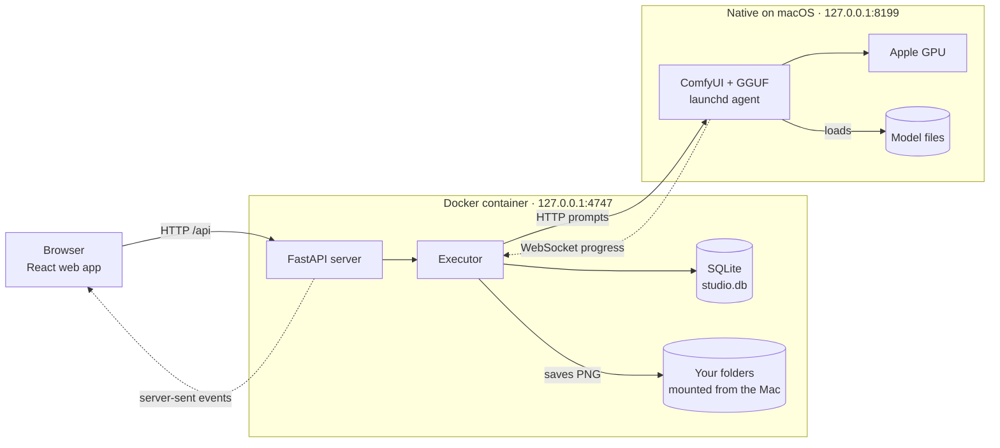
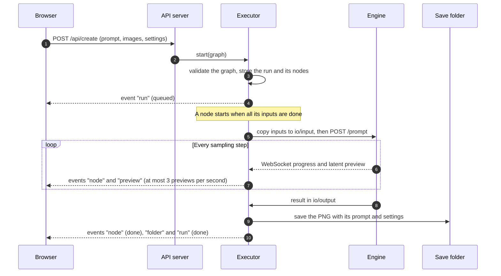
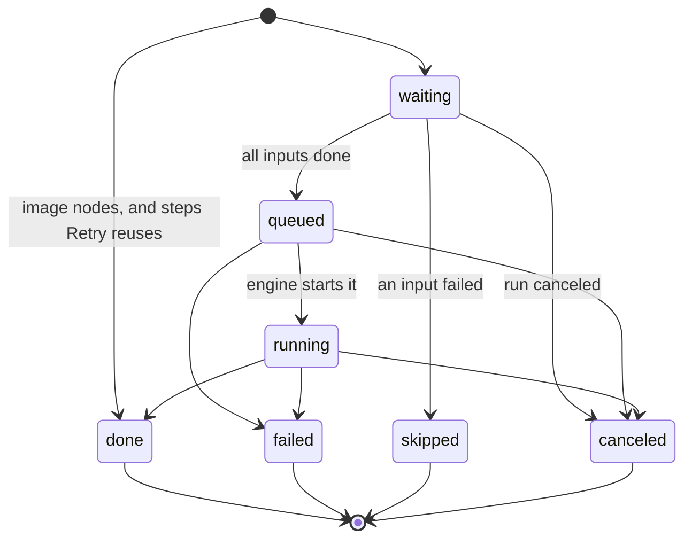

# Architecture

Image Studio has three parts: a web app in your browser, an API server in a Docker container, and a native image engine that runs on the Mac's GPU. This page explains how they fit together, how a generation travels through them, and why the design looks the way it does.

For the HTTP routes, see the [API reference](api.md). For install steps, see [Setup](setup.md).

## The three parts



- **The web app** is a React single-page app. The API server serves its built files, so there is one address to open: `http://127.0.0.1:4747`.
- **The API server** (`backend/app`) is a FastAPI app. It stores runs, workflows, folders and image records in SQLite, and it runs every generation as a graph of steps.
- **The engine** is [ComfyUI](https://github.com/Comfy-Org/ComfyUI) v0.37.4 with the [ComfyUI-GGUF](https://github.com/leejet/ComfyUI-GGUF) loader. It runs natively as a launchd agent (`com.majed.imagestudio.engine`) because it needs the GPU. The web app never talks to it directly.

## Why the engine runs outside Docker

Docker containers on macOS run in a Linux virtual machine, and that machine has no access to Metal or the Apple GPU. The model therefore has to run natively, and everything else runs in Docker.

Two settings in the engine work around problems measured on the Apple GPU on 2026-09-28:

- **The VAE runs on the CPU (`--cpu-vae`).** VAE encoding on the Apple GPU corrupts images. An encode and decode round trip had a mean error of 54/255 on the GPU, against 1.8 on the CPU, and edits came out grey and embossed.
- **The text encoders are bf16 copies.** The official text encoders are int8 and need `aten::_int_mm`, which PyTorch lacks on the Apple GPU. On the CPU the 9B prompt enhancer managed about 0.4 tokens/s. `./studio setup` converts them once with `engine/dequantize.py`, and on the GPU the enhancer runs at about 11 tokens/s.

The engine also runs with `--gpu-only`, which keeps the text encoders on the GPU. That made edits about 35% faster.

## The same paths inside and outside the container

The container mounts your home folder and `/Volumes` at the same absolute paths they have on the Mac. `/Users/you/Pictures` is `/Users/you/Pictures` inside the container too. That has three effects:

- The folder browser shows real Mac paths.
- Images are saved as normal files that Finder, Photos and other apps can open.
- The API server and the engine exchange files through shared folders without translating paths.

## How a generation runs

Every generation is a run, and every run is a graph. A Create generation is a small graph, with one Image node for each attached image and one Generate node that they feed. A workflow run uses the graph from the canvas. The executor stores a copy of the graph with the run, so later edits to the workflow don't change a run that already exists.



Details that matter when you read the code:

- **One engine prompt per image.** A Generate node with ×4 variations sends four prompts. The engine works through its queue first in, first out, so several runs interleave and each keeps its own progress. Improve is the exception. Its job goes to the front of the queue.
- **A node's inputs are ordered.** Image 1 is the first input. When an upstream node makes several variations, the next node receives the first one.
- **A failed node skips everything downstream of it.** Other branches of the same graph still finish.
- **Prompts are rewritten before they reach the model.** "image 2", "img 2" and "picture 2" become `<image2>` when that input exists. A Transparent request wraps the prompt in the model's official RGBA wording.
- **Remove background uses the same image model** with the prompt "Remove the background, and output a PNG image". It needs no extra model.
- **If the engine is offline,** jobs wait and try again every 3 seconds. After a restart of the API server, runs that were queued or running end with "Interrupted by an app restart".
- **After 10 idle minutes** the executor asks the engine to unload its models (`POST /free`), which frees the memory they use. On an M5 Max the engine went from 38 GB to 1.3 GB. A server you run yourself reads the delay from `STUDIO_IDLE_MINUTES`, where `0` turns it off. Docker Compose doesn't pass that variable, so the app in Docker always uses 10 minutes.

### Run and node states

A run is `queued`, then `running`, and ends as `done`, `failed` or `canceled`. Each node in the run moves through its own states:



**Retry** and **Run again** both start a new run from the old run's stored graph. Retry reuses every node that finished completely, so only unfinished steps run again. A node that stopped partway through its variations runs again in full. Run again makes everything from scratch.

## Live updates

The browser opens one server-sent event stream, `GET /api/events`, and keeps it open. The server sends five kinds of events:

| Event | Sent when |
|---|---|
| `engine` | The engine goes online or offline, or its queue changes |
| `run` | A run is created, makes progress, or ends |
| `node` | A node changes state or reaches a new step |
| `preview` | The engine sends a new latent preview, as an image data URL |
| `folder` | Images are added to or removed from a folder |

The engine talks to the API server over its own WebSocket. The API server translates those messages into the events above, so the browser only ever needs the one stream.

## Data and files

The runtime folder is `~/Library/Application Support/ImageStudio`:

```text
ImageStudio/
├── engine/            ComfyUI, ComfyUI-GGUF, their Python 3.13 environment, model-paths.yaml
├── io/
│   ├── input/         images copied in for the engine, one subfolder per app instance
│   ├── output/        engine results before they are saved to your folder
│   ├── temp/
│   └── user/
├── app/
│   ├── studio.db      SQLite: settings, folders, assets, workflows, runs, run_nodes, trash
│   ├── uploads/       images you dropped or pasted
│   └── thumbs/        cached thumbnails
├── trash/             deleted images, kept 30 days
└── logs/engine.log    the engine's output
```

- **Your images** go to the folder you choose. The default is `~/Pictures/Image Studio`.
- **Every saved PNG carries its prompt and settings** in a `studio` text chunk, which the Library lightbox reads back.
- **Deleted images go to the app's own trash,** because the container can't reach the macOS Trash. Undo restores them, and the server empties anything older than 30 days at startup and every hour.

## Security model

Image Studio has no login. It is meant for one person on one Mac, so it protects that person from other websites and from mistakes, not from other users of the Mac.

- **Local only.** Docker publishes port 4747 on `127.0.0.1` only, and the engine listens on `127.0.0.1:8199`.
- **No DNS rebinding.** The server answers only requests whose `Host` is `127.0.0.1`, `localhost` or `::1`.
- **No cross-site changes.** A request that changes data is refused when its `Origin` names another site. Other sites also can't read `/api` from their pages, and the app can't be shown inside another site's frame.
- **Limited file access.** The file routes read and write only inside your home folder and `/Volumes`. They refuse `~/Library` (in any letter case) and hidden folders. The app's own runtime folder can be read but never used as a save folder. The folder browser also hides macOS packages such as `.app` and `.photoslibrary`.

## Code map

| Path | What it holds |
|---|---|
| `studio` | The command-line tool: setup, start, stop, status, logs, open |
| `engine/setup.sh` | Installs ComfyUI, ComfyUI-GGUF and PyTorch into the runtime folder with `uv` |
| `engine/dequantize.py` | Converts the int8 text encoders to bf16 |
| `backend/app/main.py` | The FastAPI app, the local-only middleware, error handlers, and the static web app |
| `backend/app/api.py` | Every `/api` route |
| `backend/app/executor.py` | Runs graphs: scheduling, progress, previews, saving, retry, idle unload |
| `backend/app/engine.py` | The engine client: HTTP for prompts and the queue, one WebSocket for progress |
| `backend/app/graphs.py` | ComfyUI prompt graphs for Qwen-Image 2.1, sizes, and prompt rewriting |
| `backend/app/files.py` | Path rules, folder listings, thumbnails, saving with metadata, the trash |
| `backend/app/db.py` | The SQLite schema and queries |
| `backend/app/events.py` | The server-sent event broker |
| `backend/app/starters.py` | The starter workflows |
| `backend/app/prompts/` | System prompts for the two prompt enhancers |
| `frontend/src/pages/` | One file per screen: Create, Workflows, the workflow editor, Activity, run view, Library |
| `frontend/src/flow/` | The workflow canvas: node cards, the settings panel, graph rules, undo and redo, copy and paste, export |
| `frontend/src/components/` | The app shell, the prompt composer, folder pickers, image cards, the lightbox, and shared UI |
| `frontend/src/lib/` | The typed API client, the live event store, keyboard shortcuts, and preferences |

## Design history

The original intent, specification and build plan live in [`docs/changes/2026-09-28-image-studio/`](changes/2026-09-28-image-studio/). They record the decisions above as they were made, including the measurements behind the two GPU workarounds.
