# Product guide

Image Studio has four screens, listed in the left rail: **Create**, **Workflows**, **Activity** and **Library**. This guide walks through each one and ends with the keyboard shortcuts.

All screenshots show the app as it is in this repository, with images made by the model.

## Create

Create is one prompt box. Type what you want and press **Generate** (⌘↵, or Ctrl+Enter). The image forms live in **Recent** below the box, with a step counter.

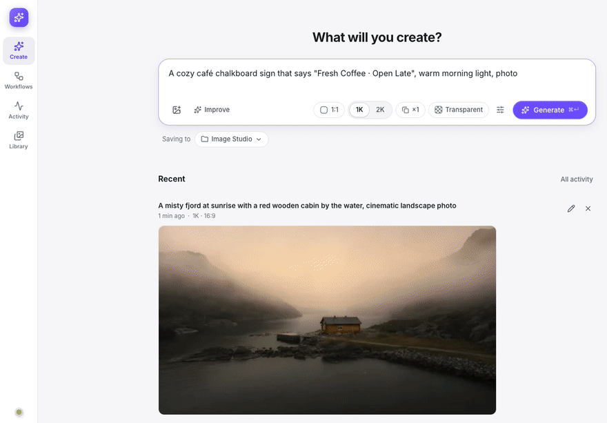

When Recent is empty, three example prompts sit below the box. Click one to try it.

### Edit and combine images

To edit an image, or to combine several, add them to the box:

- drop them anywhere on the page,
- paste them with ⌘V,
- click the image button in the box,
- click **Use as input** on a result, or
- click **Use in Create** on an image in the Library.

You can add up to 10 images. They are numbered 1, 2, 3 in order, and you can drag them to reorder. The prompt refers to them by number: "image 2", "img 2" and "picture 2" all work.

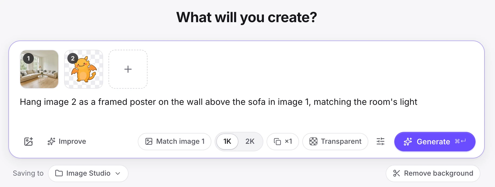

Image 1 is the one being edited. The result keeps its shape (**Match image 1**) unless you pick another aspect ratio.

With images attached, two more tools appear:

- **Mark an area.** Hover over an input and click the brush. Circle or paint the part to change, then keep the marks on the image or save them as a separate mask. The original file stays untouched.
- **Remove background.** Cuts the subject out of image 1 into a transparent PNG.

### Options

The row under the prompt holds the options you change most:

| Option | Choices |
|---|---|
| Aspect ratio | 1:1, 4:3, 3:4, 3:2, 2:3, 16:9, 9:16, and **Match image 1** when images are attached |
| Size | **1K** (about 1 megapixel) or **2K** (2048 × 2048 at 1:1) |
| Variations | ×1 to ×4 |
| **Transparent** | Makes a PNG with a transparent background |

The sliders button opens **More settings**:

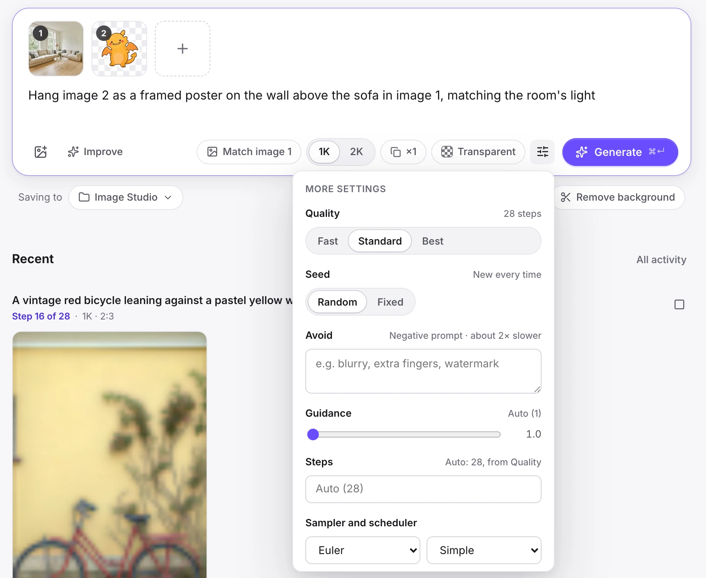

| Setting | What it does |
|---|---|
| Quality | Fast, Standard or Best: 16, 28 or 40 sampling steps |
| Seed | **Random** makes a new image every time. **Fixed** repeats a result. |
| Avoid | A negative prompt: what to keep out of the image. The app marks it "about 2× slower". |
| Guidance | How closely the model follows the prompt. Auto is 1, or 4 when Avoid is filled in. |
| Steps | Overrides the step count that Quality sets |
| Sampler and scheduler | The options the engine offers. The default is Euler with Simple. |
| Reference detail | With images attached: how much detail the model reads from them. Standard, High (2K) or Original size. |

When any of these differs from its default, **Reset to defaults** appears at the bottom and puts them back. The app remembers your settings and save folder in this browser.

### Improve a prompt

**Improve** sends your prompt to Qwen's own prompt enhancer, which rewrites it in detail and sets the aspect ratio it suggests. With images attached it uses the image-aware enhancer, which looks at them too. On an M5 Max it took about 45 seconds, or about 65 seconds when the enhancer had to load first. Click it again to stop, or click **Undo improve** to get your words back.

### Choose where images go

**Saving to** shows the current folder. Click it to pick a saved folder, or browse your Mac, make a new folder and choose it. New images go to `~/Pictures/Image Studio` until you change it.

### Recent

Recent lists up to 24 of your latest Create runs. Each finished one has **Edit again**, which puts its prompt, settings and input images back in the box. **All activity** opens the Activity screen.

Click a result to open it large. A result made from exactly one input image has a slider that compares the two.

## Workflows

A workflow is a chain of steps on a canvas. Each step's result feeds the next one. In the example below, a room photo and a sticker go into one Generate step that hangs the sticker on the wall, and a second step turns the room to evening, all in one run.

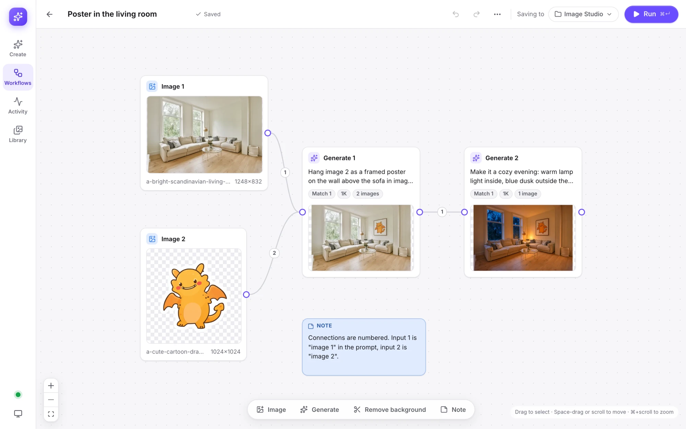

### Nodes

The toolbar at the bottom of the canvas adds nodes:

| Node | What it does | Inputs |
|---|---|---|
| **Image** | A picture from your Mac. **Replace image** and **Mark area** are in its settings. | None |
| **Generate** | Makes images from a prompt and the images connected to it | Up to 10 |
| **Remove background** | Cuts out the subject of one image | Exactly 1 |
| **Note** | A sticky note in yellow, blue, green, pink or gray. Drag its corner to resize it. | None |

### Connect nodes

- Drag from the dot on the right of a node onto another node. The connection's number is the input's position: input 1 is "image 1" in the prompt.
- Drop a connection on empty canvas to open a menu that adds the next step there.
- Click a connection and press Delete to remove it. To move it, drag the end that touches the receiving node onto another node.
- The canvas refuses loops, and notes don't connect to anything.

### Node settings

Click a node to open its settings on the right. A Generate node has the same prompt box and options as Create, plus:

- the order of its inputs, which you can drag to change,
- **Auto-improve**, which runs Improve with the node's real input images when the run starts, and
- **Save to**, a folder for this node's results.

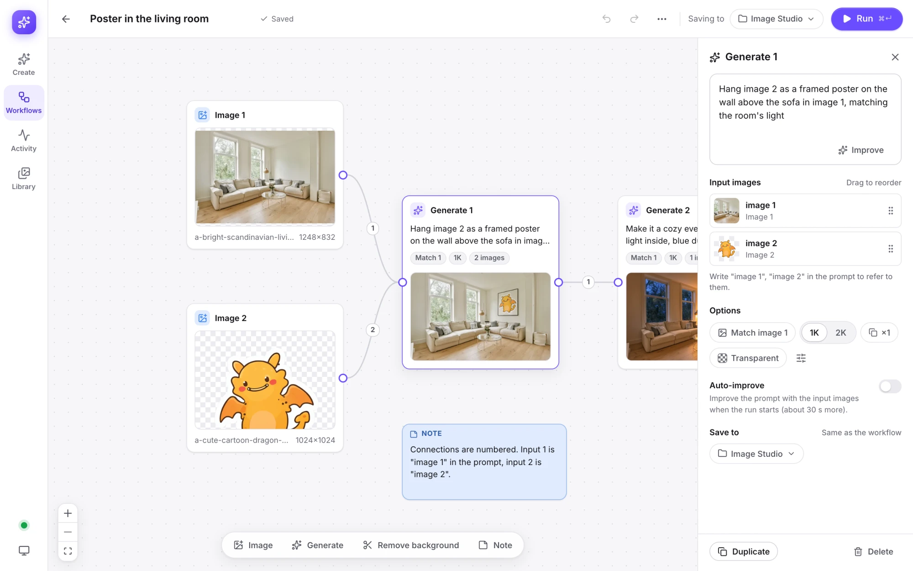

### Run a workflow

Press **Run** (⌘↵, or Ctrl+Enter). The run starts in the background and the editor stays open. The notice that appears has a **View** button, which opens the run. The run view shows each node's state: done, running with a live preview, waiting for its inputs, failed, or skipped because an earlier step failed.

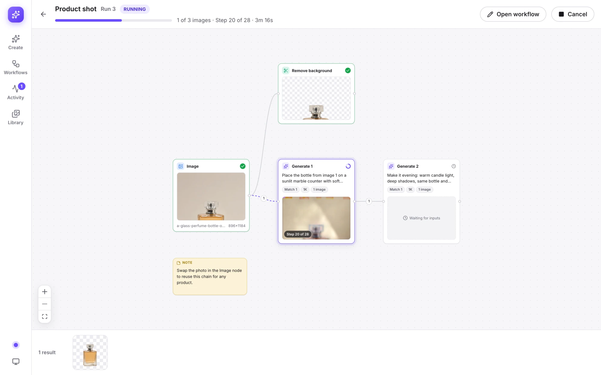

The editor saves as you work. **Undo** and **Redo** keep the last 50 changes.

### Manage workflows

The Workflows screen lists every workflow with its latest result.

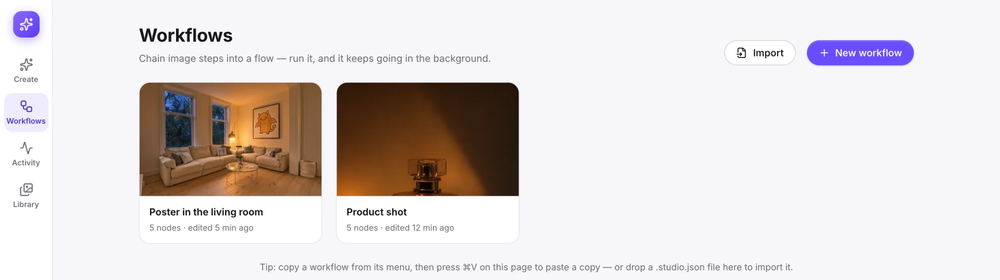

- **New workflow** starts from a starter, **Combine two images** or **Cut out and place**, or from a **Blank** canvas.

  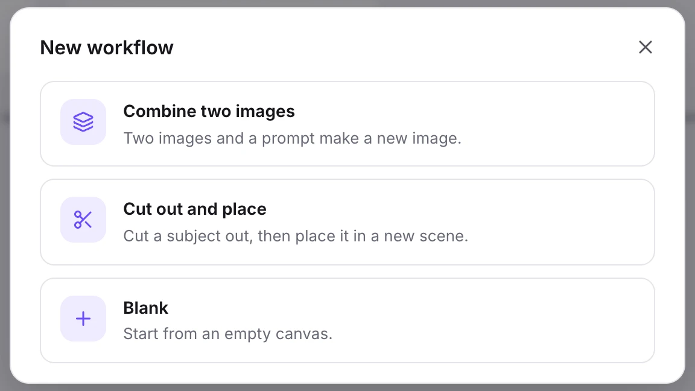

- Each card's menu has **Open**, **Run**, **Duplicate**, **Copy**, **Export file…**, **Rename** and **Delete**. Delete can be undone for a few seconds.
- **Export file…** saves a `.studio.json` file. To import one, click **Import**, drop the file on the page, or paste a copied workflow with ⌘V. A workflow file stores the paths of its images, not the images, so an import finds only images that are still at those paths.
- You can also copy nodes in one workflow and paste them into another.

## Activity

Activity lists every run from Create and from workflows, with the running ones at the top.

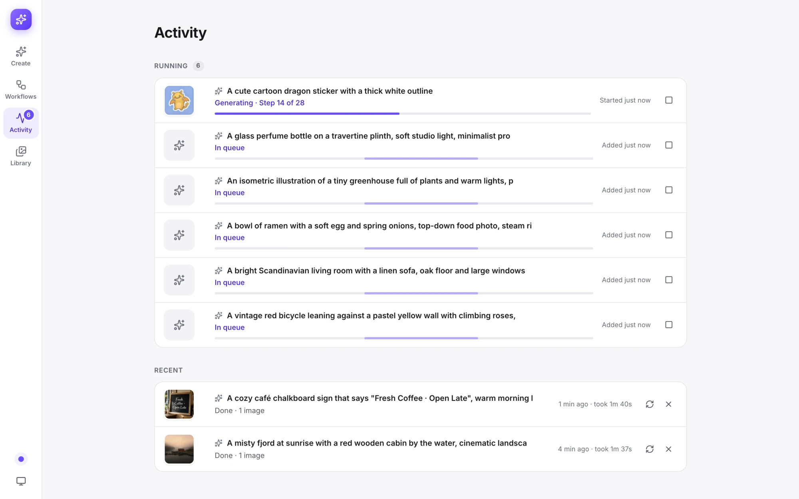

- Each running row shows its progress, for example "Generating image 2 of 5 · Step 12 of 28".
- Runs keep going when you close the browser. The engine works through them in order.
- Click a run to open it and see each step's state and results.
- **Cancel** stops a run.
- **Retry** starts a failed or canceled run again and reuses the steps that finished.
- **Run again** makes a finished run's images again from scratch, with the same graph and settings, even if you edited the workflow since.
- Activity loads the newest 60 runs when it opens.

## Library

Library shows the folders you save to and the images in them, newest first.

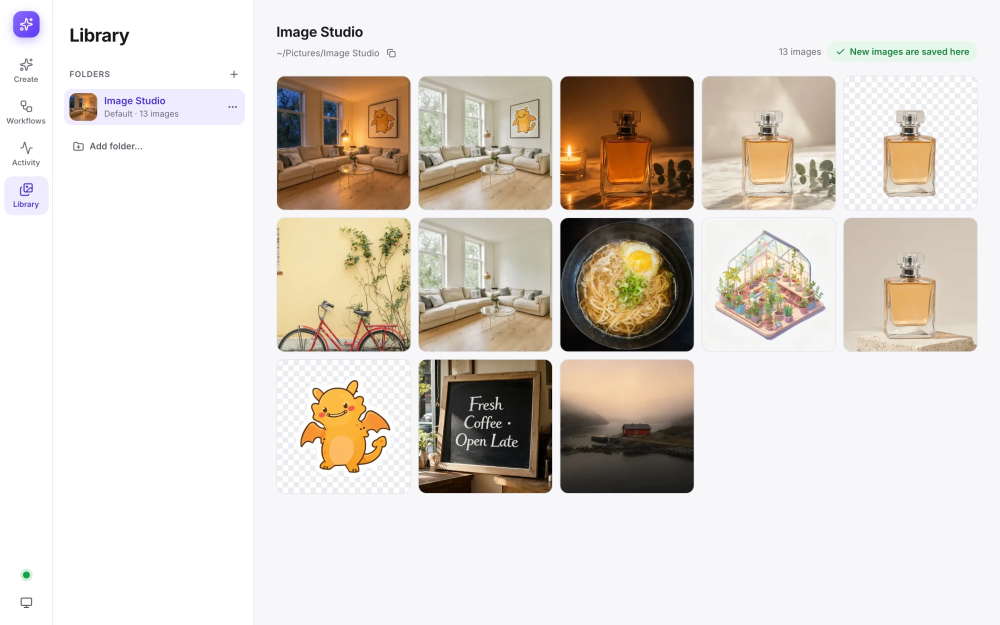

- **Add folder…** browses your Mac. It shows your home folder and external drives, and can make a new folder.
- Each folder's menu has **Pin to top**, **Rename label** and **Remove from list**. Removing a folder from the list leaves it on disk.
- **Save new images here** makes the open folder the default. The folder that is already the default says "New images are saved here".
- The button next to a folder's path copies the path.
- Click an image to open it large, with its prompt, size, seed and sampling settings. From there you can **Use in Create**, **Copy prompt**, **Download** or **Delete**. ← and → move to the previous and next image.
- **Delete** moves an image to the app's trash, and **Undo** brings it back. The trash keeps images for 30 days.

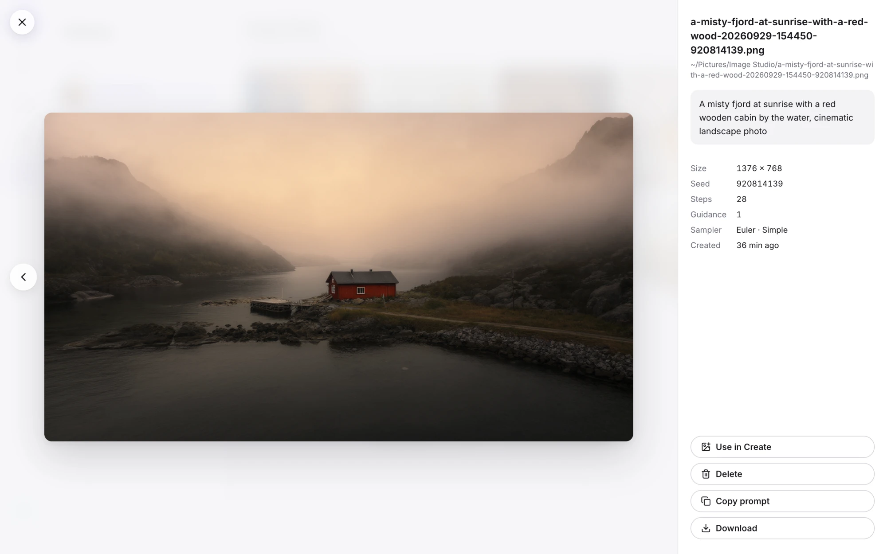

## Theme and engine status

Two buttons sit at the bottom of the left rail.

- **The dot** shows the engine. It is green when ready, pulses purple while generating, and turns red when the engine or the app is offline. Click it to see whether each model is ready or missing. When something is offline, it also shows the command to run.
- **The theme button** switches between System, Light and Dark. System follows your Mac's setting as it changes.

## Keyboard shortcuts

The table shows ⌘. Ctrl works in its place for every shortcut except pasting images into Create.

| Where | Keys | Action |
|---|---|---|
| Create | ⌘↵ | Generate |
| Create | ⌘V | Paste images from the clipboard |
| Workflow editor | ⌘↵ | Run the workflow |
| Workflow editor | ⌘Z, ⇧⌘Z or ⌘Y | Undo, redo |
| Workflow editor | ⌘A | Select every node |
| Workflow editor | ⌘C, ⌘X, ⌘V, ⌘D | Copy, cut, paste, duplicate the selection |
| Workflow editor | Delete or Backspace | Delete the selected nodes or connection |
| Workflow editor | Esc | Clear the selection |
| Workflow editor | Drag on empty canvas | Select an area |
| Workflow editor | Shift-click or ⌘-click | Add a node to the selection |
| Workflow editor | Space-drag, scroll, or drag with the middle or right mouse button | Move around the canvas |
| Workflow editor | ⌘ + scroll | Zoom |
| Workflows | ⌘V | Paste a copied workflow |
| Lightbox | ← and → | Previous and next image |
| Anywhere | Esc | Close a menu, dialog or lightbox |
